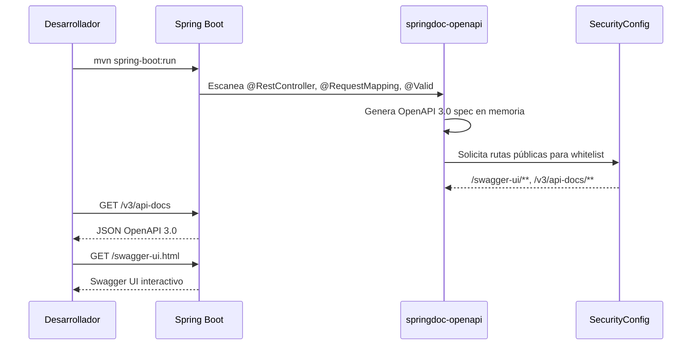
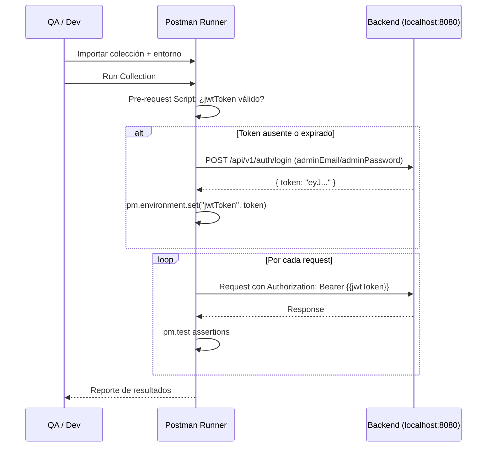
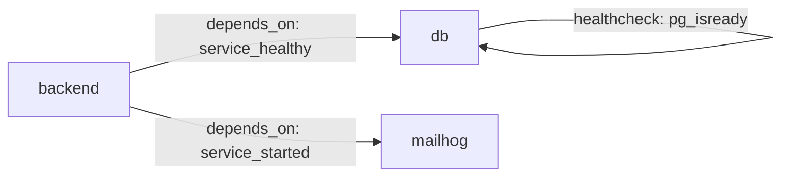

# Design Document — api-docs-and-testing

## Overview

Este feature agrega tres entregables de soporte al proyecto **smart-tourism-backend** (Spring Boot 3.3.5, Java 17, PostgreSQL):

1. **Documentación OpenAPI / Swagger** — integración de `springdoc-openapi-starter-webmvc-ui` para generar automáticamente la especificación OpenAPI 3.0 a partir de las anotaciones existentes de Spring MVC y Jakarta Validation, con configuración de seguridad JWT Bearer y agrupación por tags.
2. **Colección Postman completa** — archivo JSON exportable en formato Postman Collection v2.1 con todos los endpoints organizados por módulo, variables de entorno, pre-request script para manejo automático del token JWT, y tests automatizados para happy path y casos de error.
3. **docker-compose para desarrollo local** — archivo `docker-compose.yml` que orquesta `backend + PostgreSQL + MailHog`, con healthcheck, volumen persistente y todas las variables de entorno requeridas por `application.yml`.

El backend ya está completamente implementado. Este feature no modifica la lógica de negocio existente; únicamente agrega infraestructura de documentación, pruebas y entorno de desarrollo.

### Objetivos de diseño

- **Mínima invasión**: no modificar controllers ni servicios existentes; la documentación se genera desde las anotaciones ya presentes.
- **Configurabilidad**: toda la configuración de springdoc se centraliza en `application.yml` y es sobreescribible por variables de entorno.
- **Reproducibilidad**: el `docker-compose.yml` debe permitir ejecutar la regresión Postman completa con un solo `docker compose up`.
- **Completitud**: la colección Postman cubre el 100 % de los endpoints documentados, incluyendo escenarios de error.

---

## Architecture

Este feature se integra en la arquitectura en capas existente sin modificarla. Los tres entregables son independientes entre sí y del código de producción:

```
┌─────────────────────────────────────────────────────────────────┐
│                    Entregable 1: OpenAPI / Swagger               │
│  springdoc-openapi (dependencia Maven)                          │
│  OpenApiConfig.java (bean @Configuration)                       │
│  application.yml (sección springdoc)                            │
│  SecurityConfig.java (whitelist de rutas Swagger)               │
└─────────────────────────────────────────────────────────────────┘
┌─────────────────────────────────────────────────────────────────┐
│                    Entregable 2: Colección Postman               │
│  postman/SmartTourism.postman_collection.json                   │
│  postman/SmartTourism.postman_environment.json                  │
└─────────────────────────────────────────────────────────────────┘
┌─────────────────────────────────────────────────────────────────┐
│                    Entregable 3: docker-compose                  │
│  docker-compose.yml (raíz del proyecto)                         │
└─────────────────────────────────────────────────────────────────┘
```

### Flujo de generación de la especificación OpenAPI



### Flujo de ejecución de la colección Postman



---

## Components and Interfaces

### Entregable 1: OpenAPI / Swagger

#### `OpenApiConfig.java`

Clase de configuración Spring (`@Configuration`) ubicada en `com.smarttourism.backend.config`.

Responsabilidades:
- Definir el bean `OpenAPI` con título, versión y descripción del sistema.
- Registrar el esquema de seguridad `bearerAuth` (tipo `http`, esquema `bearer`, formato `JWT`).
- Aplicar el requisito de seguridad globalmente para que todos los endpoints protegidos muestren el candado en Swagger UI.

```java
@Bean
public OpenAPI customOpenAPI() {
    return new OpenAPI()
        .info(new Info()
            .title("Smart Tourism Santander API")
            .version("1.0.0")
            .description("API REST del backend de la plataforma Turismo Inteligente Santander. " +
                         "Gestiona experiencias turísticas, reservas, pagos y reseñas."))
        .addSecurityItem(new SecurityRequirement().addList("bearerAuth"))
        .components(new Components()
            .addSecuritySchemes("bearerAuth",
                new SecurityScheme()
                    .name("bearerAuth")
                    .type(SecurityScheme.Type.HTTP)
                    .scheme("bearer")
                    .bearerFormat("JWT")));
}
```

#### Modificación de `SecurityConfig.java`

Se deben agregar las rutas de Swagger UI y la especificación OpenAPI a la lista de rutas públicas en el `SecurityFilterChain`:

```java
.requestMatchers(
    "/swagger-ui/**",
    "/swagger-ui.html",
    "/v3/api-docs/**",
    "/v3/api-docs"
).permitAll()
```

#### Anotaciones opcionales en controllers

springdoc-openapi genera la documentación automáticamente desde las anotaciones de Spring MVC y Jakarta Validation existentes. Se agregarán anotaciones `@Tag` a nivel de clase y `@Operation` en métodos donde el nombre del método no sea suficientemente descriptivo:

| Controller | @Tag name | Descripción |
|---|---|---|
| `AuthController` | `auth` | Registro y autenticación de usuarios |
| `ExperienceController` | `experiences` | Catálogo de experiencias turísticas |
| `ScheduleController` | `schedules` | Horarios de experiencias |
| `ReservationController` | `reservations` | Gestión de reservas |
| `PaymentController` | `payments` | Simulación de pagos |
| `ReviewController` | `reviews` | Calificaciones y reseñas |
| `AdminUserController` | `admin` | Administración de usuarios |
| `AdminReservationController` | `admin` | Administración de reservas |

El endpoint `/actuator/health` se documenta mediante la integración automática de springdoc con Spring Actuator (propiedad `springdoc.show-actuator=true`).

#### Configuración en `application.yml`

```yaml
springdoc:
  api-docs:
    path: /v3/api-docs
  swagger-ui:
    path: /swagger-ui.html
    enabled: ${SPRINGDOC_SWAGGER_UI_ENABLED:true}
    try-it-out-enabled: true
    operations-sorter: alpha
    tags-sorter: alpha
  show-actuator: true
```

### Entregable 2: Colección Postman

#### Estructura de archivos

```
postman/
├── SmartTourism.postman_collection.json   # Colección v2.1
└── SmartTourism.postman_environment.json  # Variables de entorno
```

#### Variables de entorno (`SmartTourism.postman_environment.json`)

| Variable | Valor por defecto | Descripción |
|---|---|---|
| `baseUrl` | `http://localhost:8080` | URL base del backend |
| `adminEmail` | `admin@smarttourism.com` | Email del usuario admin (seed) |
| `adminPassword` | `Admin1234!` | Contraseña del admin |
| `touristEmail` | *(vacío)* | Email del turista de prueba |
| `touristPassword` | *(vacío)* | Contraseña del turista |
| `jwtToken` | *(vacío)* | Token JWT activo (auto-gestionado) |
| `adminToken` | *(vacío)* | Token JWT del admin |
| `touristToken` | *(vacío)* | Token JWT del turista |
| `experienceId` | *(vacío)* | UUID de experiencia creada en pruebas |
| `scheduleId` | *(vacío)* | UUID de horario creado en pruebas |
| `reservationId` | *(vacío)* | UUID de reserva creada en pruebas |

#### Pre-request Script a nivel de colección

El script verifica si `jwtToken` es válido (no expirado) antes de cada request. Si está ausente o expirado, ejecuta automáticamente el login con las credenciales del entorno:

```javascript
// Verificar si el token existe y no ha expirado
const token = pm.environment.get("jwtToken");
if (!token) {
    // Ejecutar login automático
    const loginRequest = {
        url: pm.environment.get("baseUrl") + "/api/v1/auth/login",
        method: "POST",
        header: { "Content-Type": "application/json" },
        body: {
            mode: "raw",
            raw: JSON.stringify({
                email: pm.environment.get("adminEmail"),
                password: pm.environment.get("adminPassword")
            })
        }
    };
    pm.sendRequest(loginRequest, (err, res) => {
        if (!err && res.code === 200) {
            pm.environment.set("jwtToken", res.json().token);
        }
    });
}
```

#### Organización de carpetas y requests

```
SmartTourism API
├── Auth
│   ├── Register (POST /api/v1/auth/register)
│   ├── Login - Admin (POST /api/v1/auth/login)
│   ├── Login - Tourist (POST /api/v1/auth/login)
│   ├── [Error] Register - Email duplicado
│   └── [Error] Login - Contraseña incorrecta
├── Experiences
│   ├── Get All Experiences (GET /api/v1/experiences)
│   ├── Get Experience by ID (GET /api/v1/experiences/{{experienceId}})
│   ├── Create Experience - Admin (POST /api/v1/experiences)
│   ├── Update Experience - Admin (PUT /api/v1/experiences/{{experienceId}})
│   ├── Delete Experience - Admin (DELETE /api/v1/experiences/{{experienceId}})
│   └── [Error] Create Experience - Sin autenticación
├── Schedules
│   ├── Create Schedule (POST /api/v1/experiences/{{experienceId}}/schedules)
│   ├── Update Schedule (PUT /api/v1/experiences/{{experienceId}}/schedules/{{scheduleId}})
│   └── Delete Schedule (DELETE /api/v1/experiences/{{experienceId}}/schedules/{{scheduleId}})
├── Reservations
│   ├── Create Reservation (POST /api/v1/reservations)
│   ├── Get My Reservations (GET /api/v1/reservations/me)
│   ├── Cancel Reservation (PATCH /api/v1/reservations/{{reservationId}}/cancel)
│   └── [Error] Create Reservation - Sin cupos
├── Payments
│   ├── Simulate Payment (POST /api/v1/payments/simulate)
│   └── [Error] Payment - Reserva expirada
├── Reviews
│   ├── Create Review (POST /api/v1/reviews)
│   ├── Get Reviews by Experience (GET /api/v1/experiences/{{experienceId}}/reviews)
│   └── [Error] Create Review - Sin reserva confirmada
├── Admin
│   ├── Get All Users (GET /api/v1/admin/users)
│   ├── Update User Status (PATCH /api/v1/admin/users/{{userId}}/status)
│   ├── Get All Reservations - Admin (GET /api/v1/admin/reservations)
│   └── [Error] Admin endpoint - Rol TOURIST
└── Health
    └── Health Check (GET /actuator/health)
```

### Entregable 3: docker-compose

#### Servicios definidos

```yaml
services:
  db:          # PostgreSQL 16 Alpine
  mailhog:     # SMTP de prueba + interfaz web
  backend:     # Spring Boot app (construida desde Dockerfile)

volumes:
  postgres_data:  # Persistencia de datos PostgreSQL
```

#### Dependencias y healthcheck



El servicio `backend` no inicia hasta que el healthcheck de `db` sea exitoso (`condition: service_healthy`). Si el backend falla al iniciar, Docker lo reintenta (`restart: on-failure`).

---

## Data Models

Este feature no introduce nuevas entidades JPA ni migraciones Flyway. Los modelos de datos relevantes son los DTOs existentes que serán documentados en la especificación OpenAPI.

### Schemas OpenAPI generados automáticamente

| Schema | Origen Java | Campos principales |
|---|---|---|
| `RegisterRequest` | `auth.dto.RegisterRequest` | `fullName`, `email`, `password`, `phone`, `documentNumber` |
| `LoginRequest` | `auth.dto.LoginRequest` | `email`, `password` |
| `AuthResponse` | `auth.dto.AuthResponse` | `token`, `user.id`, `user.fullName`, `user.email`, `user.role` |
| `ExperienceRequest` | `experiences.dto.ExperienceRequest` | `title`, `description`, `category`, `location`, `duration`, `difficulty`, `price`, `images` |
| `ExperienceResponse` | `experiences.dto.ExperienceResponse` | todos los campos + `averageRating`, `reviewCount`, `schedules` |
| `ScheduleRequest` | `schedules.dto.ScheduleRequest` | `dayOfWeek`, `startTime`, `endTime`, `availableSlots` |
| `ScheduleResponse` | `schedules.dto.ScheduleResponse` | todos los campos |
| `ReservationRequest` | `reservations.dto.ReservationRequest` | `experienceId`, `scheduleId`, `reservationDate`, `quantity` |
| `ReservationResponse` | `reservations.dto.ReservationResponse` | todos los campos + `totalAmount`, `expirationDate` |
| `PaymentRequest` | `payments.dto.PaymentRequest` | `reservationId` |
| `PaymentResponse` | `payments.dto.PaymentResponse` | `paymentStatus`, `transactionReference`, `amount`, `reservation` |
| `ReviewRequest` | `reviews.dto.ReviewRequest` | `experienceId`, `rating`, `comment` |
| `ReviewResponse` | `reviews.dto.ReviewResponse` | todos los campos |
| `UserResponse` | `admin.dto.UserResponse` | `id`, `fullName`, `email`, `phone`, `documentNumber`, `role`, `active`, `createdAt`, `updatedAt` |
| `UpdateUserStatusRequest` | `admin.dto.UpdateUserStatusRequest` | `active` |
| `ErrorResponse` | `common.dto.ErrorResponse` | `timestamp`, `status`, `error`, `message` |

### Mapeo de tipos Java → OpenAPI

| Tipo Java | Formato OpenAPI |
|---|---|
| `UUID` | `string` (format: `uuid`) |
| `LocalDate` | `string` (format: `date`) |
| `LocalDateTime` | `string` (format: `date-time`) |
| `LocalTime` | `string` (format: `time`) |
| `BigDecimal` | `number` |
| `Role`, `Difficulty`, `ReservationStatus`, `PaymentStatus`, `DayOfWeek` | `string` con `enum` values |

springdoc-openapi maneja estos mapeos automáticamente. Para `LocalTime` puede requerirse una anotación `@Schema(type = "string", format = "time")` si la versión de springdoc no lo resuelve automáticamente.

---

## Correctness Properties

*A property is a characteristic or behavior that should hold true across all valid executions of a system — essentially, a formal statement about what the system should do. Properties serve as the bridge between human-readable specifications and machine-verifiable correctness guarantees.*

La mayoría de los requisitos de este feature son verificaciones de configuración (SMOKE) o ejemplos específicos (EXAMPLE). Sin embargo, se identificaron cinco propiedades universales que son adecuadas para property-based testing:

### Property 1: Todos los endpoints de la especificación OpenAPI tienen al menos un tag

*For any* endpoint (path + método HTTP) presente en la especificación OpenAPI generada por el sistema, ese endpoint SHALL tener al menos un tag asignado del conjunto definido: `{auth, experiences, schedules, reservations, payments, reviews, admin, actuator}`.

**Validates: Requirements 5.5**

---

### Property 2: Todos los requests protegidos de la colección Postman tienen el header Authorization

*For any* request en la colección Postman que corresponda a un endpoint protegido (no público), ese request SHALL tener configurado el header `Authorization` con el valor `Bearer {{jwtToken}}`.

**Validates: Requirements 6.5**

---

### Property 3: Todos los requests de la colección Postman tienen al menos un test automatizado

*For any* request en la colección Postman, ese request SHALL tener al menos un script de test (`pm.test`) que verifique el código de estado HTTP esperado.

**Validates: Requirements 7.1**

---

### Property 4: Todas las variables de entorno requeridas por application.yml están definidas en docker-compose

*For any* variable de entorno referenciada con la sintaxis `${VAR_NAME}` en `application.yml`, esa variable SHALL estar definida en la sección `environment` del servicio `backend` en `docker-compose.yml`.

**Validates: Requirements 8.3**

---

### Property 5: Los tipos de datos Java se mapean correctamente en la especificación OpenAPI

*For any* propiedad de schema en la especificación OpenAPI generada que corresponda a un campo Java de tipo `UUID`, `LocalDate`, `LocalDateTime`, `LocalTime`, `BigDecimal` o enum, esa propiedad SHALL tener el tipo y formato OpenAPI correcto según la tabla de mapeo definida en el diseño.

**Validates: Requirements 10.3**

---

## Error Handling

Este feature no introduce nuevos endpoints de negocio, por lo que no agrega nuevos casos de error al `GlobalExceptionHandler`. Sin embargo, se deben considerar los siguientes escenarios:

### Errores de configuración de springdoc

| Escenario | Comportamiento esperado |
|---|---|
| `SPRINGDOC_SWAGGER_UI_ENABLED=false` | Swagger UI retorna 404; `/v3/api-docs` sigue disponible |
| Bean `OpenAPI` no configurado | springdoc genera spec mínima sin título ni seguridad |
| Rutas Swagger no en whitelist de Security | Spring Security retorna 401/403 al acceder a Swagger UI |

### Errores en docker-compose

| Escenario | Comportamiento esperado |
|---|---|
| `db` no saludable al iniciar | `backend` espera hasta que el healthcheck pase; `restart: on-failure` reintenta |
| Variables de entorno no definidas | Spring Boot falla al iniciar con `IllegalArgumentException` descriptivo |
| Puerto 8080 ocupado | Docker falla con error de binding; el usuario debe liberar el puerto |

### Errores en la colección Postman

| Escenario | Comportamiento esperado |
|---|---|
| `baseUrl` no definida | Los requests fallan con error de conexión; el usuario debe configurar el entorno |
| Token JWT expirado | El pre-request script ejecuta login automático y renueva el token |
| `experienceId` / `reservationId` no definidos | Los requests dependientes fallan; el usuario debe ejecutar los requests de creación primero |

---

## Testing Strategy

### Evaluación de PBT para este feature

Este feature es principalmente de configuración e infraestructura (springdoc, Postman, docker-compose). La mayoría de los requisitos son verificaciones de configuración (SMOKE) o ejemplos específicos (EXAMPLE). Sin embargo, se identificaron 5 propiedades universales adecuadas para property-based testing con **jqwik**.

### Enfoque dual: pruebas unitarias + pruebas de propiedades

#### Pruebas de propiedades (jqwik)

Se utiliza **[jqwik](https://jqwik.net/)** (ya incluido en `pom.xml` con versión `1.8.4`), integrado con JUnit 5.

Cada prueba se configura con `@Property(tries = 100)` y referencia la propiedad del diseño:

```java
// Feature: api-docs-and-testing, Property N: <texto de la propiedad>
@Property(tries = 100)
void propertyName(@ForAll ...) { ... }
```

**Propiedad 1 — Todos los endpoints tienen tag:**
```java
// Feature: api-docs-and-testing, Property 1: Todos los endpoints tienen al menos un tag
@Property(tries = 100)
void allEndpointsHaveAtLeastOneTag(
    @ForAll("endpointOperations") Map.Entry<String, Operation> entry) {
    assertThat(entry.getValue().getTags()).isNotEmpty();
}
// Generador: parsea /v3/api-docs y genera entradas de operaciones
```

**Propiedad 3 — Todos los requests Postman tienen pm.test:**
```java
// Feature: api-docs-and-testing, Property 3: Todos los requests tienen pm.test
@Property(tries = 100)
void allPostmanRequestsHaveTestScript(
    @ForAll("postmanRequests") PostmanItem item) {
    boolean hasTest = item.getEvents().stream()
        .anyMatch(e -> "test".equals(e.getListen()) && 
                       e.getScript().getExec().stream()
                           .anyMatch(line -> line.contains("pm.test")));
    assertThat(hasTest).isTrue();
}
```

**Propiedad 4 — Variables de entorno completas en docker-compose:**
```java
// Feature: api-docs-and-testing, Property 4: Todas las variables de application.yml están en docker-compose
@Property(tries = 100)
void allApplicationYmlEnvVarsDefinedInDockerCompose(
    @ForAll("applicationYmlEnvVars") String envVar) {
    assertThat(dockerComposeBackendEnvVars).contains(envVar);
}
// Generador: extrae ${VAR} de application.yml
```

**Propiedad 5 — Tipos Java mapeados correctamente:**
```java
// Feature: api-docs-and-testing, Property 5: Tipos Java mapeados correctamente en OpenAPI
@Property(tries = 100)
void javaTypesCorrectlyMappedInOpenApiSpec(
    @ForAll("schemaProperties") SchemaProperty prop) {
    assertThat(prop.getOpenApiFormat()).isEqualTo(expectedFormat(prop.getJavaType()));
}
```

#### Pruebas unitarias (JUnit 5 + Spring Boot Test)

Se enfocan en verificaciones de configuración específicas:

```
src/test/java/com/smarttourism/backend/
├── config/
│   └── OpenApiConfigTest.java          # Verifica bean OpenAPI: título, versión, bearerAuth
├── docs/
│   ├── SwaggerUiAvailabilityTest.java  # GET /swagger-ui.html → 200/302
│   ├── OpenApiSpecTest.java            # GET /v3/api-docs → 200 + JSON válido
│   └── OpenApiTagsTest.java            # Todos los endpoints tienen tags (Property 1)
├── postman/
│   ├── PostmanCollectionValidationTest.java  # Formato v2.1, carpetas, variables
│   ├── PostmanAuthHeaderTest.java            # Property 2: auth headers
│   └── PostmanTestScriptsTest.java           # Property 3: pm.test en todos los requests
└── docker/
    └── DockerComposeEnvVarsTest.java   # Property 4: variables completas
```

#### Pruebas de integración (Spring Boot Test + MockMvc)

```java
@SpringBootTest(webEnvironment = SpringBootTest.WebEnvironment.RANDOM_PORT)
class OpenApiIntegrationTest {
    // Verifica que /v3/api-docs retorna spec válida con todos los endpoints
    // Verifica que /swagger-ui.html es accesible sin autenticación
    // Verifica que los endpoints protegidos tienen securityRequirement en la spec
}
```

### Cobertura objetivo por requisito

| Requisito | Tipo de prueba | Clase de prueba |
|---|---|---|
| 1.1 Dependencia en pom.xml | SMOKE | `OpenApiDependencyTest` |
| 1.2 Swagger UI disponible | INTEGRATION | `SwaggerUiAvailabilityTest` |
| 1.3 /v3/api-docs disponible | INTEGRATION | `OpenApiSpecTest` |
| 1.4 Bean OpenAPI configurado | EXAMPLE | `OpenApiConfigTest` |
| 1.5 bearerAuth scheme | EXAMPLE | `OpenApiConfigTest` |
| 1.6 SPRINGDOC_SWAGGER_UI_ENABLED | EXAMPLE | `SwaggerUiToggleTest` |
| 2.1-2.4 Documentación Auth | EXAMPLE | `OpenApiAuthDocTest` |
| 3.1-3.4 Documentación Experiences/Schedules | EXAMPLE | `OpenApiExperiencesDocTest` |
| 4.1-4.6 Documentación Reservations/Payments/Reviews | EXAMPLE | `OpenApiReservationsDocTest` |
| 5.1-5.4 Documentación Admin/Actuator | EXAMPLE | `OpenApiAdminDocTest` |
| 5.5 Tags en todos los endpoints | PROPERTY | `OpenApiTagsPropertyTest` |
| 6.1-6.4 Estructura colección Postman | EXAMPLE | `PostmanCollectionValidationTest` |
| 6.5 Auth headers en requests protegidos | PROPERTY | `PostmanAuthHeaderPropertyTest` |
| 7.1 pm.test en todos los requests | PROPERTY | `PostmanTestScriptsPropertyTest` |
| 7.2-7.6 Escenarios de prueba Postman | EXAMPLE | `PostmanScenariosTest` |
| 8.1-8.8 docker-compose | SMOKE | `DockerComposeValidationTest` |
| 8.3 Variables de entorno completas | PROPERTY | `DockerComposeEnvVarsPropertyTest` |
| 9.1-9.4 Configuración springdoc en yml | SMOKE | `SpringdocConfigTest` |
| 10.3 Tipos Java → OpenAPI | PROPERTY | `OpenApiTypeMappingPropertyTest` |
| 10.4 Required fields | EXAMPLE | `OpenApiRequiredFieldsTest` |

### Configuración de jqwik (ya presente en pom.xml)

```xml
<dependency>
    <groupId>net.jqwik</groupId>
    <artifactId>jqwik</artifactId>
    <version>1.8.4</version>
    <scope>test</scope>
</dependency>
```

### Notas de implementación de las pruebas

- Las pruebas de la colección Postman y docker-compose son **pruebas de archivos estáticos**: parsean los JSON/YAML generados y verifican su estructura. No requieren levantar el servidor.
- Las pruebas de la especificación OpenAPI requieren `@SpringBootTest` con `WebEnvironment.RANDOM_PORT` para obtener la spec generada en tiempo de ejecución.
- Los generadores jqwik para las propiedades 1, 3 y 5 parsean los archivos de salida (spec JSON, colección Postman) y generan entradas aleatorias del conjunto de elementos encontrados.
- La propiedad 4 es determinista (no aleatoria en sentido estricto): extrae todas las variables `${VAR}` de `application.yml` y verifica que cada una esté en docker-compose. Se implementa como `@Property` para mantener consistencia con el framework.
