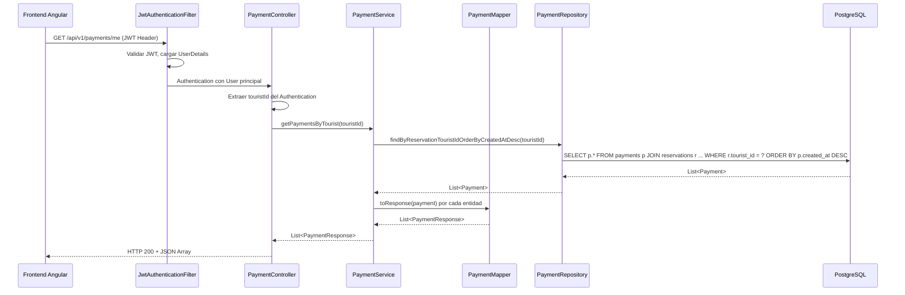
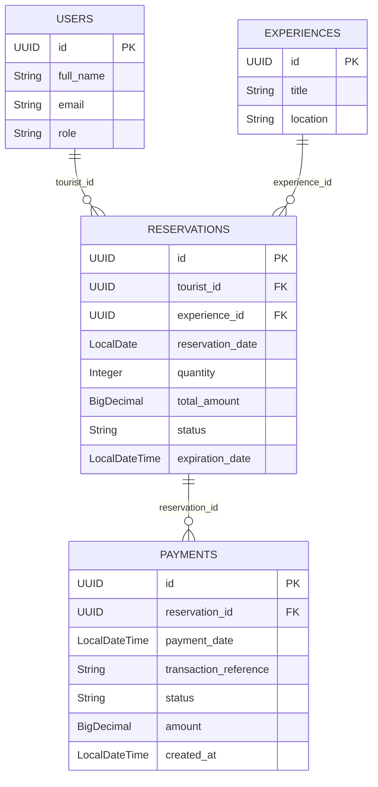

# Design Document

## Overview

Este documento describe el diseño técnico para implementar el endpoint `GET /api/v1/payments/me` en el backend Spring Boot de SmartTourism. El endpoint permite al turista autenticado consultar su historial de pagos, retornando una lista de `PaymentResponse` ordenada por fecha de creación descendente.

La implementación sigue la arquitectura existente del módulo `payments`: se añade un método de consulta en `PaymentRepository`, un método de servicio en `PaymentService`, y un nuevo endpoint GET en `PaymentController`. Se reutiliza el `PaymentMapper` existente para la conversión entidad→DTO.

## Architecture

El flujo de la petición sigue el patrón estándar de capas del proyecto:



**Decisiones de diseño:**
- Se reutiliza el `PaymentController` existente (ya tiene `@PreAuthorize("hasRole('TOURIST')")` a nivel de clase).
- Se usa una JPQL query con `JOIN FETCH` para cargar las relaciones en una sola consulta y evitar N+1.
- El ordenamiento se realiza en la base de datos (no en memoria) para eficiencia.

## Components and Interfaces

### PaymentRepository (modificación)

Se añade un método de consulta con JPQL personalizado:

```java
@Query("SELECT p FROM Payment p " +
       "JOIN FETCH p.reservation r " +
       "JOIN FETCH r.tourist " +
       "JOIN FETCH r.experience " +
       "WHERE r.tourist.id = :touristId " +
       "ORDER BY p.createdAt DESC")
List<Payment> findByTouristIdWithDetails(@Param("touristId") UUID touristId);
```

**Justificación**: Se usa `JOIN FETCH` para cargar `reservation`, `tourist` y `experience` en una sola query, evitando el problema N+1 que ocurriría con lazy loading al mapear cada Payment a PaymentResponse.

### PaymentService (modificación)

Se añade un método público:

```java
@Transactional(readOnly = true)
public List<PaymentResponse> getPaymentsByTourist(UUID touristId) {
    List<Payment> payments = paymentRepository.findByTouristIdWithDetails(touristId);
    return payments.stream()
            .map(paymentMapper::toResponse)
            .toList();
}
```

**Justificación**: `readOnly = true` optimiza la transacción para lectura. Se delega el ordenamiento a la query de base de datos.

### PaymentController (modificación)

Se añade un nuevo endpoint GET:

```java
@Operation(summary = "Obtener historial de pagos del turista autenticado")
@GetMapping("/me")
public ResponseEntity<List<PaymentResponse>> getMyPayments(Authentication authentication) {
    UUID touristId = extractUserIdFromAuthentication(authentication);
    List<PaymentResponse> payments = paymentService.getPaymentsByTourist(touristId);
    return ResponseEntity.ok(payments);
}
```

**Justificación**: Se reutiliza el método privado `extractUserIdFromAuthentication` ya existente en el controlador. La ruta `/me` sigue la convención REST del proyecto para recursos del usuario autenticado.

## Data Models

### Entidades existentes (sin modificación)



### DTO de respuesta (existente, sin modificación)

`PaymentResponse` ya contiene todos los campos necesarios:
- Campos de Payment: `id`, `paymentStatus`, `transactionReference`, `amount`, `createdAt`
- Campos aplanados de Reservation: `reservationId`, `reservationStatus`, `reservationDate`, `quantity`, `totalAmount`, `expirationDate`
- Campos aplanados de Tourist: `touristId`, `touristName`, `touristEmail`
- Campos aplanados de Experience: `experienceId`, `experienceTitle`, `experienceLocation`

## Correctness Properties

*A property is a characteristic or behavior that should hold true across all valid executions of a system — essentially, a formal statement about what the system should do. Properties serve as the bridge between human-readable specifications and machine-verifiable correctness guarantees.*

### Property 1: Aislamiento de datos por turista

*For any* tourist ID and any set of payments in the system, the service method `getPaymentsByTourist(touristId)` SHALL return only payments whose associated reservation belongs to that tourist — no payment belonging to a different tourist shall appear in the result.

**Validates: Requirements 1.1, 3.1, 3.3**

### Property 2: Ordenamiento descendente por fecha de creación

*For any* list of payments returned by `getPaymentsByTourist`, the `createdAt` field of each element SHALL be greater than or equal to the `createdAt` of the next element in the list (i.e., the list is sorted in descending chronological order).

**Validates: Requirements 1.3, 4.2**

### Property 3: Correctitud del mapeo entidad→DTO

*For any* Payment entity with a complete association graph (reservation with tourist and experience), the PaymentMapper SHALL produce a PaymentResponse where each flattened field matches its source value in the entity graph (e.g., `response.touristName == payment.reservation.tourist.fullName`, `response.experienceTitle == payment.reservation.experience.title`).

**Validates: Requirements 5.2, 5.3**

## Error Handling

| Escenario | HTTP Status | Mensaje | Responsable |
|-----------|-------------|---------|-------------|
| Sin token JWT | 401 Unauthorized | — | JwtAuthenticationFilter |
| Rol diferente a TOURIST | 403 Forbidden | — | Spring Security (@PreAuthorize) |
| Token válido, sin pagos | 200 OK | `[]` (lista vacía) | PaymentController |
| Error interno de BD | 500 Internal Server Error | Mensaje genérico | GlobalExceptionHandler existente |

**Notas:**
- No se requiere manejo de errores adicional en el controlador o servicio para este endpoint.
- Los errores 401/403 son manejados automáticamente por la cadena de filtros de Spring Security existente.
- El caso de "sin pagos" no es un error — retorna una lista vacía con HTTP 200.

## Testing Strategy

### Property-Based Tests (jqwik)

Se utilizará **jqwik** (ya configurado en el proyecto, versión 1.8.4) para los tests de propiedades:

- **Mínimo 100 iteraciones** por propiedad.
- Cada test referencia su propiedad del documento de diseño.
- Tag format: **Feature: payments-history-endpoint, Property {number}: {property_text}**

| Propiedad | Estrategia de generación |
|-----------|--------------------------|
| Property 1 (Aislamiento) | Generar múltiples turistas con UUIDs aleatorios, crear pagos asociados a diferentes turistas, invocar el servicio con un tourist ID específico y verificar que solo retorna sus pagos. Usar mock del repositorio. |
| Property 2 (Ordenamiento) | Generar listas de Payment con `createdAt` aleatorios, configurar el mock del repositorio para retornarlos ya ordenados (simulando la query), verificar que el servicio preserva el orden. Alternativamente, testear la lógica de ordenamiento directamente. |
| Property 3 (Mapeo) | Generar entidades Payment con Reservation, Tourist y Experience con valores aleatorios, invocar el mapper real (MapStruct), verificar que cada campo del DTO coincide con su fuente en el grafo de entidades. |

### Unit Tests (JUnit 5)

Tests de ejemplo específicos para complementar las propiedades:

- **Endpoint retorna lista vacía**: Tourist sin pagos → HTTP 200 + `[]`
- **Endpoint retorna pagos correctos**: Tourist con 3 pagos → HTTP 200 + lista de 3 elementos
- **Seguridad 401**: Petición sin token → 401
- **Seguridad 403**: Usuario con rol ADMIN → 403

### Integration Tests

- Test con Testcontainers (PostgreSQL) verificando que la query JPQL con `JOIN FETCH` funciona correctamente contra una base de datos real.
- Verificar que no hay N+1 queries (inspección de logs SQL o conteo de queries).

### Configuración de tests

```java
@Property(tries = 100)
// Feature: payments-history-endpoint, Property 1: Aislamiento de datos por turista
void onlyTouristOwnPaymentsAreReturned(...) { ... }
```
