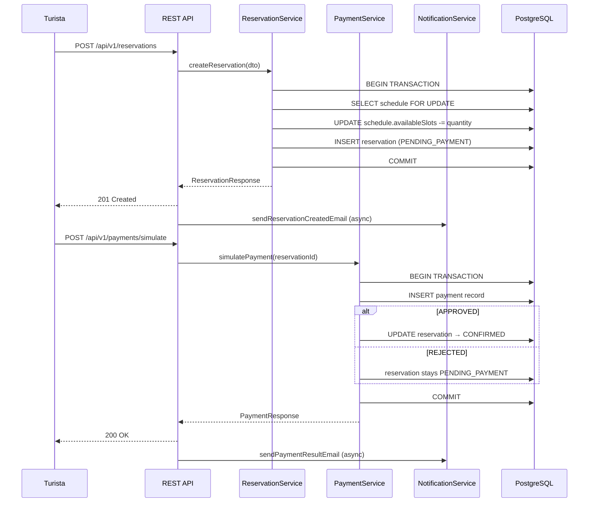
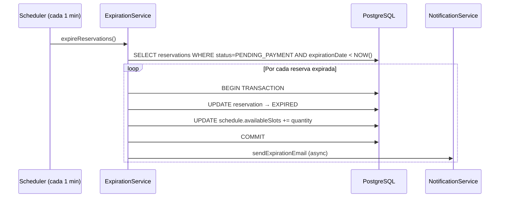
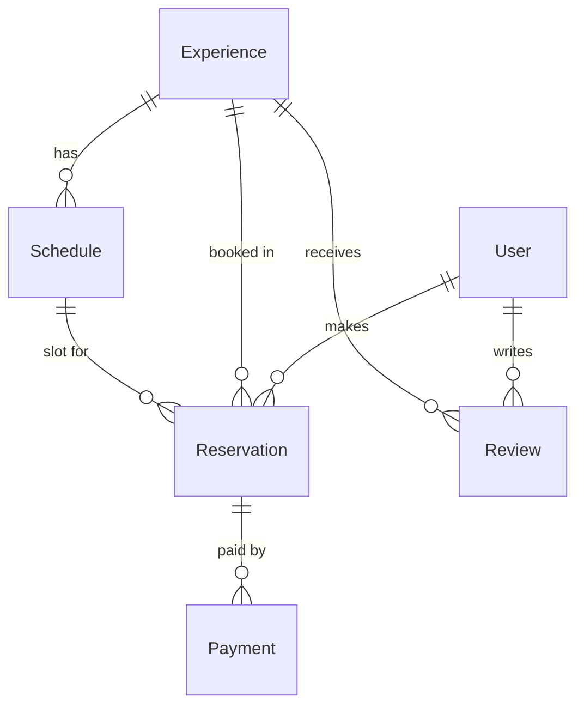

# Design Document — smart-tourism-backend

## Overview

El backend de **Turismo Inteligente smart-tourism** es un sistema monolítico modular construido con **Java 21** y **Spring Boot 3**. Expone una API REST bajo el prefijo `/api/v1`, protegida con JWT, y está diseñado para desplegarse en Koyeb mediante Docker.

El sistema gestiona el ciclo de vida completo de las experiencias turísticas del departamento de Santander: desde el registro y autenticación de usuarios, pasando por la consulta y filtrado del catálogo, la creación y gestión de reservas con control de cupos, la simulación de pagos, la calificación de experiencias, hasta las notificaciones por correo electrónico y el panel de administración.

### Objetivos de diseño

- **Modularidad**: código organizado por módulo funcional para facilitar el mantenimiento y las pruebas.
- **Seguridad**: autenticación sin estado con JWT, contraseñas cifradas con BCrypt, autorización basada en roles.
- **Integridad de datos**: transacciones de base de datos para operaciones críticas (reservas, pagos), control de sobreventa.
- **Observabilidad**: health check vía Spring Actuator, logs estructurados, registro de errores de notificación.
- **Portabilidad**: configuración 100 % por variables de entorno, imagen Docker lista para Koyeb.

---

## Architecture

El sistema sigue el patrón de **arquitectura en capas** (Layered Architecture):

```
┌─────────────────────────────────────────────────────────┐
│                  Presentation Layer                      │
│  REST Controllers  ·  DTOs  ·  Exception Handlers       │
├─────────────────────────────────────────────────────────┤
│                  Application Layer                       │
│  Services  ·  Use Cases  ·  Mappers (MapStruct)         │
├─────────────────────────────────────────────────────────┤
│                   Domain Layer                           │
│  Entities  ·  Enums  ·  Domain Rules                    │
├─────────────────────────────────────────────────────────┤
│                 Persistence Layer                        │
│  JPA Repositories  ·  Flyway Migrations  ·  PostgreSQL  │
└─────────────────────────────────────────────────────────┘
```

### Módulos funcionales

```
com.smarttourism.backend
├── auth            # Registro, login, generación/validación JWT
├── users           # Gestión de usuarios (admin)
├── experiences     # Catálogo, filtrado, CRUD admin
├── schedules       # Horarios de experiencias
├── reservations    # Creación, consulta, cancelación, expiración
├── payments        # Simulación de pagos
├── reviews         # Calificaciones y reseñas
├── notifications   # Envío asíncrono de correos (SMTP)
├── admin           # Endpoints exclusivos de administración
├── security        # Filtros JWT, configuración Spring Security
├── config          # CORS, Async, Scheduler, beans globales
└── common          # DTOs compartidos, excepciones, utilidades
```

### Diagrama de flujo principal (reserva + pago)



### Proceso de expiración automática



---

## Components and Interfaces

### Security Filter Chain

```
Request → JwtAuthenticationFilter → UsernamePasswordAuthenticationFilter
        → SecurityFilterChain (Spring Security)
```

- `JwtAuthenticationFilter`: extrae el token del header `Authorization: Bearer <token>`, lo valida con `JwtService`, y carga el `UserDetails` en el `SecurityContext`.
- `JwtService`: genera y valida tokens JWT usando la librería `io.jsonwebtoken` (JJWT). El secreto y el tiempo de expiración se leen de variables de entorno.
- `UserDetailsServiceImpl`: carga el usuario desde la base de datos por email para la autenticación.

### REST Controllers

| Controller | Ruta base | Roles permitidos |
|---|---|---|
| `AuthController` | `/api/v1/auth` | Público |
| `ExperienceController` | `/api/v1/experiences` | Público (GET), ADMIN (POST/PUT/DELETE) |
| `ScheduleController` | `/api/v1/experiences/{id}/schedules` | ADMIN |
| `ReservationController` | `/api/v1/reservations` | TOURIST |
| `PaymentController` | `/api/v1/payments` | TOURIST |
| `ReviewController` | `/api/v1/reviews` | TOURIST (POST), Público (GET) |
| `AdminReservationController` | `/api/v1/admin/reservations` | ADMIN |
| `AdminUserController` | `/api/v1/admin/users` | ADMIN |

### Service Layer

- **`AuthService`**: registro (validación de unicidad, hash BCrypt, asignación de rol TOURIST, generación JWT) y login (autenticación, generación JWT).
- **`ExperienceService`**: CRUD de experiencias, filtrado dinámico con `JPA Specification`, paginación.
- **`ReservationService`**: creación con bloqueo pesimista (`SELECT FOR UPDATE`), cancelación, consulta por turista.
- **`ExpirationService`**: tarea programada (`@Scheduled`) que expira reservas `PENDING_PAYMENT` vencidas.
- **`PaymentService`**: simulación de pago (lógica aleatoria configurable), actualización de estado de reserva.
- **`ReviewService`**: creación de reseña con validación de reserva confirmada y unicidad.
- **`NotificationService`**: envío asíncrono de correos con `JavaMailSender` y plantillas de texto.
- **`AdminService`**: gestión de usuarios (listado, cambio de estado).

### Mappers (MapStruct)

Cada módulo tiene su propio mapper:
- `UserMapper`, `ExperienceMapper`, `ScheduleMapper`, `ReservationMapper`, `PaymentMapper`, `ReviewMapper`

### Exception Handling

`GlobalExceptionHandler` (`@RestControllerAdvice`) captura:
- `ResourceNotFoundException` → 404
- `DuplicateResourceException` → 409
- `BusinessRuleException` → 422
- `AccessDeniedException` → 403
- `AuthenticationException` → 401
- `MethodArgumentNotValidException` → 400 (con lista de campos inválidos)
- `Exception` genérica → 500

Formato de respuesta de error uniforme:
```json
{
  "timestamp": "2024-01-15T10:30:00Z",
  "status": 409,
  "error": "Conflict",
  "message": "El correo ya está registrado"
}
```

---

## Data Models

### Entidades JPA

#### `User`
```
id              UUID (PK)
fullName        VARCHAR(150) NOT NULL
email           VARCHAR(255) UNIQUE NOT NULL
password        VARCHAR(255) NOT NULL  -- BCrypt hash
phone           VARCHAR(20)
documentNumber  VARCHAR(30) UNIQUE NOT NULL
role            ENUM('ADMIN','TOURIST') NOT NULL
active          BOOLEAN DEFAULT TRUE
createdAt       TIMESTAMP
updatedAt       TIMESTAMP
```

#### `Experience`
```
id          UUID (PK)
title       VARCHAR(200) NOT NULL
description TEXT
category    VARCHAR(100) NOT NULL
location    VARCHAR(200) NOT NULL
duration    INTEGER  -- minutos
difficulty  ENUM('EASY','MODERATE','HARD','EXTREME')
price       DECIMAL(10,2) NOT NULL
images      TEXT[]  -- array de URLs
active      BOOLEAN DEFAULT TRUE
createdAt   TIMESTAMP
updatedAt   TIMESTAMP
```

#### `Schedule`
```
id              UUID (PK)
experience_id   UUID (FK → Experience)
dayOfWeek       ENUM('MONDAY',...,'SUNDAY')
startTime       TIME NOT NULL
endTime         TIME NOT NULL
availableSlots  INTEGER NOT NULL
active          BOOLEAN DEFAULT TRUE
```

#### `Reservation`
```
id              UUID (PK)
tourist_id      UUID (FK → User)
experience_id   UUID (FK → Experience)
schedule_id     UUID (FK → Schedule)
reservationDate DATE NOT NULL
quantity        INTEGER NOT NULL
totalAmount     DECIMAL(10,2) NOT NULL
status          ENUM('PENDING_PAYMENT','CONFIRMED','CANCELLED','EXPIRED','NO_SHOW')
expirationDate  TIMESTAMP NOT NULL  -- createdAt + 15 min
createdAt       TIMESTAMP
updatedAt       TIMESTAMP
```

#### `Payment`
```
id                   UUID (PK)
reservation_id       UUID (FK → Reservation)
paymentDate          TIMESTAMP NOT NULL
transactionReference VARCHAR(100) UNIQUE NOT NULL
status               ENUM('PENDING','APPROVED','REJECTED','EXPIRED')
amount               DECIMAL(10,2) NOT NULL
createdAt            TIMESTAMP
```

#### `Review`
```
id            UUID (PK)
tourist_id    UUID (FK → User)
experience_id UUID (FK → Experience)
rating        INTEGER NOT NULL  -- 1..5
comment       TEXT
createdAt     TIMESTAMP
UNIQUE(tourist_id, experience_id)
```

### Diagrama ER simplificado



### Migraciones Flyway

```
db/migration/
  V1__create_users_table.sql
  V2__create_experiences_table.sql
  V3__create_schedules_table.sql
  V4__create_reservations_table.sql
  V5__create_payments_table.sql
  V6__create_reviews_table.sql
  V7__seed_admin_user.sql
```

---

## Correctness Properties

*A property is a characteristic or behavior that should hold true across all valid executions of a system — essentially, a formal statement about what the system should do. Properties serve as the bridge between human-readable specifications and machine-verifiable correctness guarantees.*

### Property 1: Unicidad de email y documento en registro

*For any* par de solicitudes de registro que compartan el mismo `email` o el mismo `documentNumber`, el sistema SHALL aceptar únicamente la primera y rechazar la segunda con HTTP 409, de modo que en ningún momento existan dos usuarios con el mismo email o el mismo número de documento en la base de datos.

**Validates: Requirements 1.2, 1.3**

---

### Property 2: Contraseña almacenada como hash BCrypt

*For any* usuario registrado, el valor almacenado en la columna `password` de la base de datos SHALL ser un hash BCrypt válido y SHALL ser diferente del texto plano original, de modo que nunca se persista una contraseña en texto claro.

**Validates: Requirements 1.5**

---

### Property 3: Token JWT contiene rol y es verificable

*For any* usuario autenticado exitosamente, el token JWT retornado SHALL contener el rol del usuario en su payload y SHALL ser verificable con la clave secreta del sistema, de modo que cualquier solicitud posterior con ese token pueda determinar el rol sin consultar la base de datos.

**Validates: Requirements 2.1, 2.6**

---

### Property 4: Fallo de autenticación nunca retorna HTTP 200

*For any* solicitud de login con credenciales incorrectas (email inexistente o contraseña errónea), el sistema SHALL retornar un código HTTP distinto de 200 (específicamente 401), garantizando que ningún fallo de autenticación sea indistinguible de un éxito.

**Validates: Requirements 2.2, 2.3**

---

### Property 5: Filtros de experiencias son conjuntivos (AND)

*For any* combinación de filtros válidos (`category`, `location`, `difficulty`, `minPrice`, `maxPrice`, `available`) aplicados simultáneamente, cada experiencia retornada SHALL satisfacer todos los filtros proporcionados, y ninguna experiencia que viole al menos uno de los filtros SHALL aparecer en los resultados.

**Validates: Requirements 4.1, 4.2, 4.3, 4.4, 4.5, 4.6**

---

### Property 6: Control de sobreventa — los cupos nunca son negativos

*For any* secuencia de operaciones de creación de reservas sobre un horario dado, el valor de `availableSlots` del horario SHALL ser siempre mayor o igual a cero, y la suma de `quantity` de todas las reservas activas (`PENDING_PAYMENT` o `CONFIRMED`) para ese horario SHALL nunca superar la capacidad máxima original del horario.

**Validates: Requirements 6.1, 5.3**

---

### Property 7: Restauración de cupos en cancelación y expiración

*For any* reserva que transite al estado `CANCELLED` o `EXPIRED`, el valor de `availableSlots` del horario asociado SHALL incrementarse exactamente en la `quantity` de esa reserva, de modo que los cupos liberados sean siempre iguales a los cupos que fueron bloqueados al crear la reserva.

**Validates: Requirements 5.6, 6.2**

---

### Property 8: Expiración automática a los 15 minutos

*For any* reserva con estado `PENDING_PAYMENT` cuya `expirationDate` sea anterior al instante actual, el proceso programado SHALL cambiar su estado a `EXPIRED` en un intervalo máximo de 1 minuto desde el vencimiento, y SHALL restaurar los cupos correspondientes.

**Validates: Requirements 6.2, 6.3**

---

### Property 9: Confirmación de reserva solo por pago APPROVED

*For any* intento de pago simulado, el estado de la reserva asociada SHALL cambiar a `CONFIRMED` si y solo si el `paymentStatus` resultante es explícitamente `APPROVED`; cualquier otro resultado (`REJECTED`, `PENDING`, `EXPIRED`) SHALL dejar la reserva en su estado anterior.

**Validates: Requirements 7.2, 7.3**

---

### Property 10: Reseña solo para experiencias con reserva CONFIRMED

*For any* solicitud de creación de reseña, el sistema SHALL aceptarla si y solo si el turista tiene al menos una reserva con estado `CONFIRMED` para la experiencia calificada; en caso contrario SHALL rechazarla con HTTP 403.

**Validates: Requirements 8.3**

---

### Property 11: Rating dentro del rango válido [1, 5]

*For any* valor de `rating` enviado en una solicitud de reseña, el sistema SHALL aceptarlo si y solo si es un entero en el rango cerrado [1, 5]; cualquier valor fuera de ese rango SHALL ser rechazado con HTTP 400.

**Validates: Requirements 8.2**

---

### Property 12: Endpoints de administración inaccesibles para TOURIST

*For any* solicitud a un endpoint de administración (`/api/v1/admin/**`, `POST/PUT/DELETE /api/v1/experiences`, `POST/PUT/DELETE /api/v1/experiences/{id}/schedules`) realizada con un token JWT de rol `TOURIST`, el sistema SHALL retornar HTTP 403 sin ejecutar la operación solicitada.

**Validates: Requirements 9.4**

---

### Property 13: Formato de error uniforme

*For any* respuesta de error del sistema (4xx o 5xx), el cuerpo de la respuesta SHALL ser un objeto JSON que contenga los campos `timestamp`, `status`, `error` y `message`, garantizando que el formato de error sea consistente independientemente del tipo de error.

**Validates: Requirements 12.7**

---

## Error Handling

### Estrategia global

Todos los errores son capturados por `GlobalExceptionHandler` (`@RestControllerAdvice`). Ningún stack trace es expuesto al cliente en producción.

### Jerarquía de excepciones de dominio

```
RuntimeException
├── ResourceNotFoundException       → HTTP 404
├── DuplicateResourceException      → HTTP 409
├── BusinessRuleException           → HTTP 422
│   ├── InsufficientSlotsException
│   ├── InvalidReservationStateException
│   └── PaymentNotAllowedException
├── InvalidDateException            → HTTP 400
└── UnauthorizedAccessException     → HTTP 403
```

### Casos de error críticos

| Escenario | Código HTTP | Mensaje |
|---|---|---|
| Email ya registrado | 409 | "El correo ya está registrado" |
| Documento ya registrado | 409 | "El número de documento ya está registrado" |
| Credenciales inválidas | 401 | "Credenciales inválidas" (genérico) |
| Cuenta inactiva | 403 | "La cuenta no está habilitada" |
| Token JWT inválido/expirado | 401 | "Token de autenticación inválido o expirado" |
| Experiencia no encontrada | 404 | "Experiencia no encontrada" |
| Sin cupos disponibles | 409 | "No hay cupos disponibles para el horario seleccionado" |
| Fecha de reserva pasada | 400 | "La fecha de reserva no puede ser anterior a hoy" |
| Reserva no cancelable | 422 | "La reserva no puede ser cancelada en su estado actual: {status}" |
| Pago no procesable | 422 | "No se puede procesar el pago para una reserva en estado: {status}" |
| Rating fuera de rango | 400 | "El rating debe ser un entero entre 1 y 5" |
| Reseña duplicada | 409 | "Ya existe una reseña del turista para esta experiencia" |
| Sin reserva confirmada para reseña | 403 | "Solo puedes calificar experiencias que hayas reservado" |

### Manejo de errores en notificaciones

Los errores de envío de correo son capturados en el método asíncrono, registrados con nivel `ERROR` en el log, y no propagan la excepción al hilo principal. El flujo de negocio no se ve afectado.

---

## Testing Strategy

### Enfoque dual: pruebas unitarias + pruebas de propiedades

#### Pruebas unitarias (JUnit 5 + Mockito)

Se enfocan en:
- Casos concretos de lógica de negocio (ej. cálculo de `totalAmount`, `expirationDate`).
- Condiciones de error específicas (ej. reserva con estado inválido para pago).
- Integración entre capas con mocks (ej. `ReservationService` con `ScheduleRepository` mockeado).
- Validación de mappers MapStruct.

Evitar: duplicar cobertura que ya proveen las pruebas de propiedades.

#### Pruebas de propiedades (jqwik — librería PBT para Java)

Se utiliza **[jqwik](https://jqwik.net/)** como librería de property-based testing para Java, integrada con JUnit 5.

Cada prueba de propiedad se configura con un mínimo de **100 iteraciones** (`@Property(tries = 100)`).

Cada prueba referencia la propiedad del documento de diseño con un comentario:
```java
// Feature: smart-tourism-backend, Property N: <texto de la propiedad>
```

#### Pruebas de integración (Spring Boot Test + Testcontainers)

- Levantan un contenedor PostgreSQL real con Testcontainers.
- Verifican el flujo completo: registro → login → reserva → pago → reseña.
- Verifican la configuración de CORS y el health check de Actuator.
- Se ejecutan en un perfil separado (`test`) para no interferir con las pruebas unitarias.

### Cobertura objetivo

| Módulo | Tipo de prueba prioritario |
|---|---|
| `auth` | Unitaria + Propiedad (unicidad, JWT) |
| `experiences` | Propiedad (filtros conjuntivos) |
| `reservations` | Propiedad (cupos, estados) + Integración |
| `payments` | Propiedad (confirmación solo por APPROVED) |
| `reviews` | Propiedad (rating, unicidad) |
| `notifications` | Unitaria (mock de JavaMailSender) |
| `admin` | Unitaria + Integración (autorización) |
| `security` | Integración (JWT filter chain) |

### Configuración de jqwik

```xml
<!-- pom.xml -->
<dependency>
    <groupId>net.jqwik</groupId>
    <artifactId>jqwik</artifactId>
    <version>1.8.4</version>
    <scope>test</scope>
</dependency>
```

Ejemplo de estructura de prueba de propiedad:

```java
// Feature: smart-tourism-backend, Property 11: Rating dentro del rango válido [1, 5]
@Property(tries = 100)
void ratingOutOfRangeShouldBeRejected(@ForAll @IntRange(min = Integer.MIN_VALUE, max = 0) int invalidRating) {
    // ...assert HTTP 400
}

@Property(tries = 100)
void ratingInRangeShouldBeAccepted(@ForAll @IntRange(min = 1, max = 5) int validRating) {
    // ...assert no validation error
}
```
